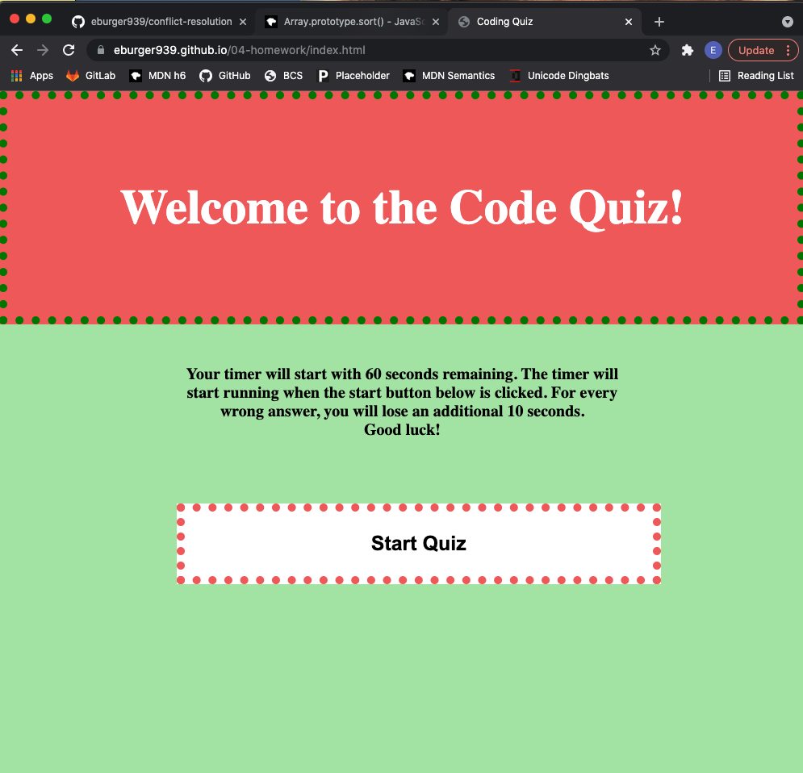

# Homework 4 - code quiz
* Due on 12/14/2021
* Received assistance from my tutor Faran and worked with Taylor, Ben, Alix, Emily, and Logan on various occasions

## Description
* Created a coding quiz that included a home page with a start button.  After the start button is clicked, a timer starts and the user is presented with the first question.  For an incorrect answer, the user will have an additional 10 seconds deducted from their time.  After the last question or when the time reaches 0, the quiz is complete and the user is shown how many questions they got correct.  The user is then to put input their intitials into the input box so that the scores can be stored.  The user then can view all scores in order of the best first, can clear the scores, and can return to the home page to take the quiz again. 

## Screen shot of final depolyed webpage

## Link to deployed application
* https://eburger939.github.io/04-homework/